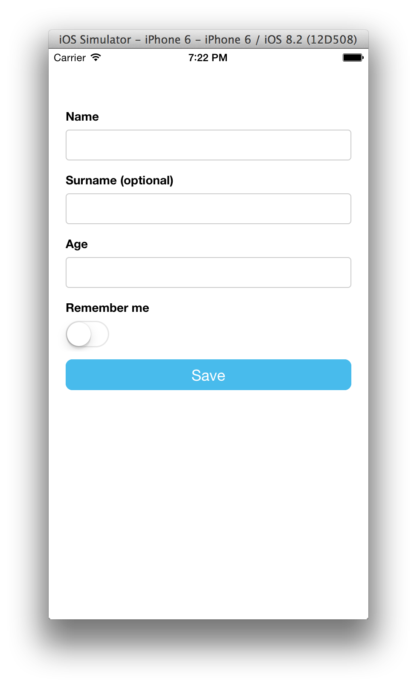
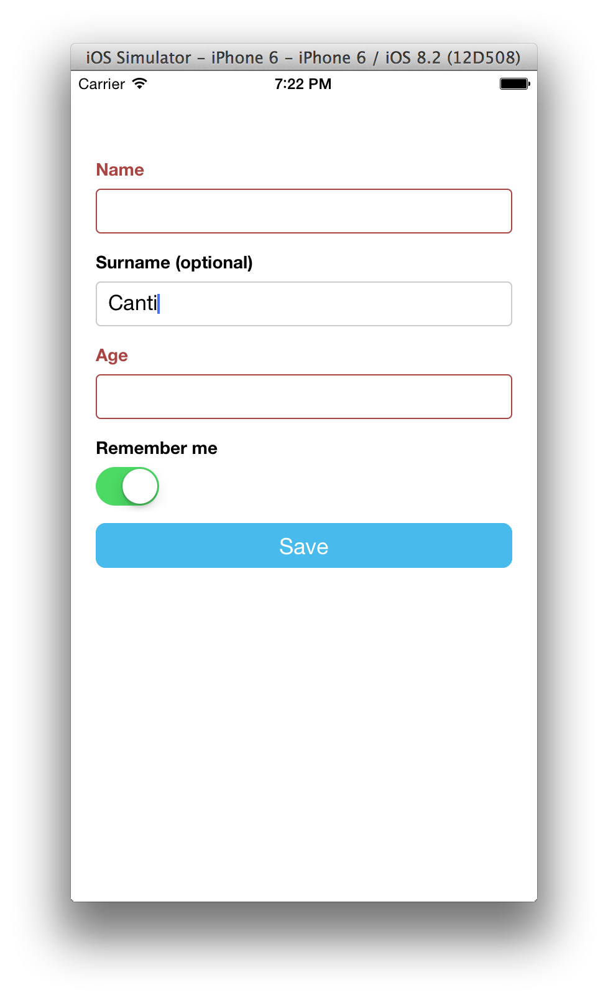
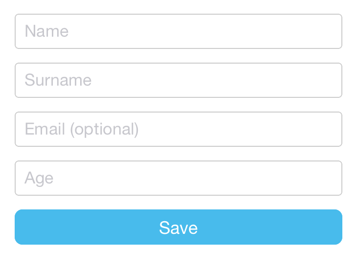
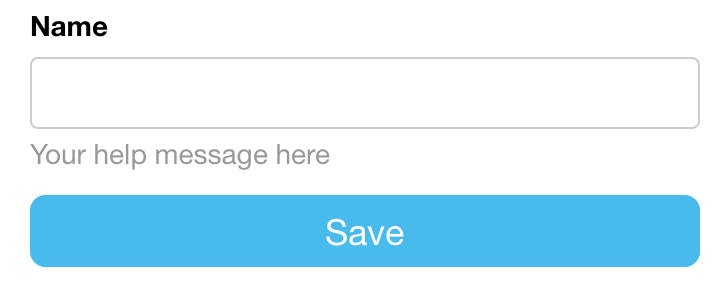
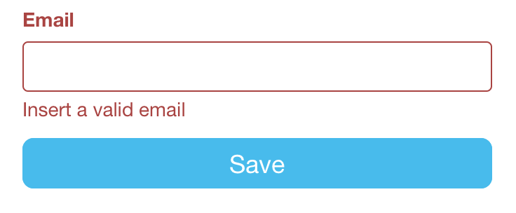

# tcomb-form-native

> A React Native library for building forms with React 19+ and TypeScript

## Notice

This is a modernized fork of `tcomb-form-native` with the following improvements:

- **React 19+ Support**: Updated to work with the latest React version
- **TypeScript**: Full TypeScript support with type definitions
- **Modern JavaScript**: Refactored to use modern JavaScript/TypeScript features
- **Modular Architecture**: Components are now properly modularized and tree-shakeable
- **Improved Developer Experience**: Better TypeScript support and modern tooling

## Features

- 🚀 Built for React 19 and React Native 0.74+
- 🏗️ TypeScript-first development
- 🧩 Modular component architecture
- 🎨 Customizable theming and styling
- 📱 Cross-platform support (iOS & Android)
- 🔄 Form state management
- ✅ Built-in validation

# Contents

- [Setup](#setup)
- [Supported react-native versions](#supported-react-native-versions)
- [Example](#example)
- [API](#api)
- [Types](#types)
- [Rendering options](#rendering-options)
- [Unions](#unions)
- [Lists](#lists)
- [Customizations](#customizations)
- [Tests](#tests)
- [License](#license)

# Setup

```bash
# Using npm (scoped)
npm install @riebel/tcomb-form-native-ts

# Using yarn (scoped)
yarn add @riebel/tcomb-form-native-ts
```

## Migration and scoped package

You can use this package under the personal npm scope `@riebel` or keep the original import name via an npm alias.

- Direct scoped install:
  ```bash
  npm i @riebel/tcomb-form-native-ts
  # or
  yarn add @riebel/tcomb-form-native-ts
  ```
  Import:
  ```ts
  import t from '@riebel/tcomb-form-native-ts';
  ```

- Keep imports unchanged with npm alias (consumer app `package.json`):
  ```json
  {
    "dependencies": {
      "tcomb-form-native": "npm:@riebel/tcomb-form-native-ts@^1.0.0"
    }
  }
  ```
  Import remains:
  ```ts
  import t from 'tcomb-form-native';
  ```

Legacy API shape is preserved: default import exposes `t.form.Form` and field factories; named exports like `Form`, `templates`, `stylesheet`, and `i18n` are also available.

## Peer Dependencies

This library requires the following peer dependencies:

```json
{
  "@react-native-picker/picker": "^2.11.1",
  "react": "^19.1.1",
  "react-native": "^0.79.4",
  "@react-native-community/datetimepicker": "^8.0.0"
}
```

### Benefits

With **tcomb-form-native-ts** you simply call `<Form type={Model} />` to generate a form based on that domain model. What does this get you?

1. Write a lot less code
2. Usability and accessibility for free (automatic labels, inline validation, etc)
3. No need to update forms when domain model changes

### JSON Schema support

JSON Schemas are also supported via the (tiny) [tcomb-json-schema library](https://github.com/gcanti/tcomb-json-schema).

### Pluggable look and feel

The look and feel is customizable via react-native stylesheets and *templates* (see documentation).

### Screencast

http://react.rocks/example/tcomb-form-native

### Example App

[https://github.com/bartonhammond/snowflake](https://github.com/bartonhammond/snowflake) React-Native, Tcomb, Redux, Parse.com, Jest - 88% coverage

# Example

```js
// index.ios.js

'use strict';

var React = require('react-native');
var t = require('@riebel/tcomb-form-native-ts');
var { AppRegistry, StyleSheet, Text, View, TouchableHighlight } = React;

var Form = t.form.Form;

// here we are: define your domain model
var Person = t.struct({
  name: t.String,              // a required string
  surname: t.maybe(t.String),  // an optional string
  age: t.Number,               // a required number
  rememberMe: t.Boolean        // a boolean
});

var options = {}; // optional rendering options (see documentation)

var AwesomeProject = React.createClass({

  onPress: function () {
    // call getValue() to get the values of the form
    var value = this.refs.form.getValue();
    if (value) { // if validation fails, value will be null
      console.log(value); // value here is an instance of Person
    }
  },

  render: function() {
    return (
      <View style={styles.container}>
        {/* display */}
        <Form
          ref="form"
          type={Person}
          options={options}
        />
        <TouchableHighlight style={styles.button} onPress={this.onPress} underlayColor='#99d9f4'>
          <Text style={styles.buttonText}>Save</Text>
        </TouchableHighlight>
      </View>
    );
  }
});

var styles = StyleSheet.create({
  container: {
    justifyContent: 'center',
    marginTop: 50,
    padding: 20,
    backgroundColor: '#ffffff',
  },
  buttonText: {
    fontSize: 18,
    color: 'white',
    alignSelf: 'center'
  },
  button: {
    height: 36,
    backgroundColor: '#48BBEC',
    borderColor: '#48BBEC',
    borderWidth: 1,
    borderRadius: 8,
    marginBottom: 10,
    alignSelf: 'stretch',
    justifyContent: 'center'
  }
});

AppRegistry.registerComponent('AwesomeProject', () => AwesomeProject);
```

**Output:**

(Labels are automatically generated)



**Ouput after a validation error:**



# Documentation

## Components

### Form

The main form component that handles form rendering and state management.

#### Props

| Prop | Type | Description |
|------|------|-------------|
| `type` | `Type` | The tcomb type definition for the form |
| `value` | `object` | The current form values |
| `onChange` | `(value: any) => void` | Callback when form values change |
| `options` | `object` | Form rendering options |
| `templates` | `object` | Custom templates for form fields |
| `stylesheets` | `object` | Custom styles for form elements |
| `context` | `any` | Context to pass to validators |
| `auto` | `string` | Auto configuration for form fields |
| `hasDefaultValue` | `boolean` | Whether to use default values from the type |

### Field Components

- `Textbox` - Text input field
- `Checkbox` - Checkbox input field
- `Select` - Dropdown selection field
- `DatePicker` - Date/Time picker field
- `List` - List/array field
- `Struct` - Group of form fields

## Types

### Built-in Types

- `t.String` - Text input
- `t.Number` - Number input
- `t.Boolean` - Checkbox input
- `t.Date` - Date picker
- `t.enums` - Dropdown select
- `t.list` - List/array
- `t.struct` - Group of fields

### Custom Types

You can create custom field types by extending the base types:

```typescript
var t = require('@riebel/tcomb-form-native-ts');

// Create a custom email type
const Email = t.refinement(t.String, (str) => {
  const re = /^[^\s@]+@[^\s@]+\.[^\s@]+$/;
  return re.test(str);
}, 'Email');

// Create a custom URL type
const URL = t.refinement(t.String, (str) => {
  const re = /^(https?:\/\/)?([\da-z.-]+)\.([a-z.]{2,6})([\/\w .-]*)*\/?$/;
  return re.test(str);
}, 'URL');
```

## Styling

You can customize the look and feel of the form by providing custom styles:

```typescript
const styles = {
  formGroup: {
    normal: {
      marginBottom: 20
    },
    error: {
      marginBottom: 20,
      borderColor: 'red'
    }
  },
  controlLabel: {
    normal: {
      fontSize: 16,
      marginBottom: 8,
      fontWeight: '600'
    },
    error: {
      color: 'red'
    }
  },
  // ... other styles
};

<Form
  type={MyForm}
  stylesheets={styles}
/>
```

## Validation

### Built-in Validators

```typescript
const Person = t.struct({
  name: t.String,  // Required field
  age: t.maybe(t.Number),  // Optional field
  email: t.String,  // Required field with email validation
  website: t.maybe(t.String)  // Optional field
});
```

### Custom Validators

```typescript
const Person = t.struct({
  name: t.String,
  age: t.refinement(t.Number, (n) => n >= 18, 'Must be 18 or older'),
  email: t.refinement(t.String, (s) => /@/.test(s), 'Invalid email')
});
```

## Custom Templates

You can create custom templates for form fields:

```typescript
const customTemplates = {
  textbox: (locals) => {
    return (
      <View>
        <Text>{locals.label}</Text>
        <TextInput
          value={locals.value}
          onChangeText={locals.onChange}
          placeholder={locals.placeholder}
        />
        {locals.error && <Text style={{color: 'red'}}>{locals.error}</Text>}
      </View>
    );
  }
};

<Form
  type={MyForm}
  templates={customTemplates}
/>
```

## Platform-Specific Code

This library supports platform-specific implementations. The following files are available:

- `Textbox.native.tsx` - Cross-platform text input
- `Checkbox.native.tsx` - Cross-platform checkbox
- `Select.ios.tsx` - iOS select component
- `Select.android.tsx` - Android select component
- `DatePicker.ios.tsx` - iOS date picker
- `DatePicker.android.tsx` - Android date picker

## Contributing

We welcome contributions! Please read our [Contributing Guide](CONTRIBUTING.md) to get started.

## License

MIT

## `getValue()`

Returns `null` if the validation failed, an instance of your model otherwise.

> **Note**. Calling `getValue` will cause the validation of all the fields of the form, including some side effects like highlighting the errors.

## `validate()`

Returns a `ValidationResult` (see [tcomb-validation](https://github.com/gcanti/tcomb-validation) for a reference documentation).

## Adding a default value and listen to changes

The `Form` component behaves like a [controlled component](https://facebook.github.io/react/docs/forms.html):

```js
var Person = t.struct({
  name: t.String,
  surname: t.maybe(t.String)
});

var AwesomeProject = React.createClass({

  getInitialState() {
    return {
      value: {
        name: 'Giulio',
        surname: 'Canti'
      }
    };
  },

  onChange(value) {
    this.setState({value});
  },

  onPress: function () {
    var value = this.refs.form.getValue();
    if (value) {
      console.log(value);
    }
  },

  render: function() {
    return (
      <View style={styles.container}>
        <Form
          ref="form"
          type={Person}
          value={this.state.value}
          onChange={this.onChange}
        />
        <TouchableHighlight style={styles.button} onPress={this.onPress} underlayColor='#99d9f4'>
          <Text style={styles.buttonText}>Save</Text>
        </TouchableHighlight>
      </View>
    );
  }
});
```

The `onChange` handler has the following signature:

```
(raw: any, path: Array<string | number>) => void
```

where

- `raw` contains the current raw value of the form (can be an invalid value for your model)
- `path` is the path to the field triggering the change

> **Warning**. tcomb-form-native-ts uses `shouldComponentUpdate` aggressively. In order to ensure that tcomb-form-native-ts detects any change to `type`, `options` or `value` props you have to change references:

## Disable a field based on another field's value

```typescript
var Type = t.struct({
  disable: t.Boolean, // if true, name field will be disabled
  name: t.String
});

// see the "Rendering options" section in this guide
var options = {
  fields: {
    name: {}
  }
};

var AwesomeProject = React.createClass({

  getInitialState() {
    return {
      options: options,
      value: null
    };
  },

  onChange(value) {
    // tcomb immutability helpers
    // https://github.com/gcanti/tcomb/blob/master/docs/API.md#updating-immutable-instances
    var options = t.update(this.state.options, {
      fields: {
        name: {
          editable: {'$set': !value.disable}
        }
      }
    });
    this.setState({options: options, value: value});
  },

  onPress: function () {
    var value = this.refs.form.getValue();
    if (value) {
      console.log(value);
    }
  },

  render: function() {
    return (
      <View style={styles.container}>
        <Form
          ref="form"
          type={Type}
          options={this.state.options}
          value={this.state.value}
          onChange={this.onChange}
        />
        <TouchableHighlight style={styles.button} onPress={this.onPress} underlayColor='#99d9f4'>
          <Text style={styles.buttonText}>Save</Text>
        </TouchableHighlight>
      </View>
    );
  }

});
```

## How to get access to a field

You can get access to a field with the `getComponent(path)` API:

```typescript
var Person = t.struct({
  name: t.String,
  surname: t.maybe(t.String),
  age: t.Number,
  rememberMe: t.Boolean
});

var AwesomeProject = React.createClass({

  componentDidMount() {
    // give focus to the name textbox
    this.refs.form.getComponent('name').refs.input.focus();
  },

  onPress: function () {
    var value = this.refs.form.getValue();
    if (value) {
      console.log(value);
    }
  },

  render: function() {
    return (
      <View style={styles.container}>
        <Form
          ref="form"
          type={Person}
        />
        <TouchableHighlight style={styles.button} onPress={this.onPress} underlayColor='#99d9f4'>
          <Text style={styles.buttonText}>Save</Text>
        </TouchableHighlight>
      </View>
    );
  }
});
```

## How to clear form after submit

```typescript
var Person = t.struct({
  name: t.String,
  surname: t.maybe(t.String),
  age: t.Number,
  rememberMe: t.Boolean
});

var AwesomeProject = React.createClass({

  getInitialState() {
    return { value: null };
  },

  onChange(value) {
    this.setState({ value });
  },

  clearForm() {
    // clear content from all textbox
    this.setState({ value: null });
  },

  onPress: function () {
    var value = this.refs.form.getValue();
    if (value) {
      console.log(value);
      // clear all fields after submit
      this.clearForm();
    }
  },

  render: function() {
    return (
      <View style={styles.container}>
        <Form
          ref="form"
          type={Person}
          value={this.state.value}
          onChange={this.onChange.bind(this)}
        />
        <TouchableHighlight style={styles.button} onPress={this.onPress} underlayColor='#99d9f4'>
          <Text style={styles.buttonText}>Save</Text>
        </TouchableHighlight>
      </View>
    );
  }
});
```

## Dynamic forms example: how to change a form based on selection

Say I have an iOS Picker, depending on which option is selected in this picker I want the next component to either be a checkbox or a textbox:

```typescript
const Country = t.enums({
  'IT': 'Italy',
  'US': 'United States'
}, 'Country');

var AwesomeProject = React.createClass({

  // returns the suitable type based on the form value
  getType(value) {
    if (value.country === 'IT') {
      return t.struct({
        country: Country,
        rememberMe: t.Boolean
      });
    } else if (value.country === 'US') {
      return t.struct({
        country: Country,
        name: t.String
      });
    } else {
      return t.struct({
        country: Country
      });
    }
  },

  getInitialState() {
    const value = {};
    return { value, type: this.getType(value) };
  },

  onChange(value) {
    // recalculate the type only if strictly necessary
    const type = value.country !== this.state.value.country ?
      this.getType(value) :
      this.state.type;
    this.setState({ value, type });
  },

  onPress() {
    var value = this.refs.form.getValue();
    if (value) {
      console.log(value);
    }
  },

  render() {

    return (
      <View style={styles.container}>
        <t.form.Form
          ref="form"
          type={this.state.type}
          value={this.state.value}
          onChange={this.onChange}
        />
        <TouchableHighlight style={styles.button} onPress={this.onPress} underlayColor='#99d9f4'>
          <Text style={styles.buttonText}>Save</Text>
        </TouchableHighlight>
      </View>
    );
  }
});
```

# Types

### Required field

By default fields are required:

```typescript
var Person = t.struct({
  name: t.String,    // a required string
  surname: t.String  // a required string
});
```

### Optional field

In order to create an optional field, wrap the field type with the `t.maybe` combinator:

```typescript
var Person = t.struct({
  name: t.String,
  surname: t.String,
  email: t.maybe(t.String) // an optional string
});
```

The postfix `" (optional)"` is automatically added to optional fields.

You can customise the postfix value or setting a postfix for required fields:

```typescript
t.form.Form.i18n = {
  optional: '',
  required: ' (required)' // inverting the behaviour: adding a postfix to the required fields
};
```

### Numbers

In order to create a numeric field, use the `t.Number` type:

```typescript
var Person = t.struct({
  name: t.String,
  surname: t.String,
  email: t.maybe(t.String),
  age: t.Number // a numeric field
});
```

tcomb-form-native-ts will convert automatically numbers to / from strings.

### Booleans

In order to create a boolean field, use the `t.Boolean` type:

```js
var Person = t.struct({
  name: t.String,
  surname: t.String,
  email: t.maybe(t.String),
  age: t.Number,
  rememberMe: t.Boolean // a boolean field
});
```

Booleans are displayed as `SwitchIOS`s.

### Dates

In order to create a date field, use the `t.Date` type:

```js
var Person = t.struct({
  name: t.String,
  surname: t.String,
  email: t.maybe(t.String),
  age: t.Number,
  birthDate: t.Date // a date field
});
```

Dates are displayed as `DatePickerIOS`s under iOS and `DatePickerAndroid` or `TimePickerAndroid` under Android, depending on the `mode` selected (`date` or `time`).

Under Android, use the `fields` option to configure which `mode` to display the Picker:

```js
// see the "Rendering options" section in this guide
var options = {
  fields: {
    birthDate: {
      mode: 'date' // display the Date field as a DatePickerAndroid
    }
  }
};
```

#### iOS date `config` option

The bundled template will render an iOS `UIDatePicker` component, but collapsed into a touchable component in order to improve usability. A `config` object can be passed to customize it with the following parameters:

| Key | Value |
|-----|-------|
| `animation` | The animation to collapse the date picker. Defaults to `Animated.timing`. |
| `animationConfig` | The animation configuration object. Defaults to `{duration: 200}` for the default animation. |
| `format` | A `(date) => String(date)` kind of function to provide a custom date format parsing to display the value. Optional, defaults to `(date) => String(date)`.
| `defaultValueText` | An `string` to customize the default value of the `null` date value text. |

For the collapsible customization, look at the `dateTouchable` and `dateValue` keys in the stylesheet file.

#### Android date `config` option

When using a `t.Date` type in Android, it can be configured through a `config` option that take the following parameters:

| Key | Value |
|-----|-------|
| ``background`` | Determines the type of background drawable that's going to be used to display feedback. Optional, defaults to ``TouchableNativeFeedback.SelectableBackground``. |
| ``format`` | A ``(date) => String(date)`` kind of function to provide a custom date format parsing to display the value. Optional, defaults to ``(date) => String(date)``.
| ``dialogMode`` | Determines the type of datepicker mode for Android (`default`, `spinner` or `calendar`). |
| `defaultValueText` | An `string` to customize the default value of the `null` date value text. |

### Enums

In order to create an enum field, use the `t.enums` combinator:

```js
var Gender = t.enums({
  M: 'Male',
  F: 'Female'
});

var Person = t.struct({
  name: t.String,
  surname: t.String,
  email: t.maybe(t.String),
  age: t.Number,
  rememberMe: t.Boolean,
  gender: Gender // enum
});
```

Enums are displayed as `Picker`s.

#### iOS select `config` option

The bundled template will render an iOS `UIPickerView` component, but collapsed into a touchable component in order to improve usability. A `config` object can be passed to customize it with the following parameters:

| Key | Value |
|-----|-------|
| `animation` | The animation to collapse the date picker. Defaults to `Animated.timing`. |
| `animationConfig` | The animation configuration object. Defaults to `{duration: 200}` for the default animation. |

For the collapsible customization, look at the `pickerContainer`, `pickerTouchable` and `pickerValue` keys in the stylesheet file.

### Refinements

A *predicate* is a function with the following signature:

```
(x: any) => boolean
```

You can refine a type with the `t.refinement(type, predicate)` combinator:

```js
// a type representing positive numbers
var Positive = t.refinement(t.Number, function (n) {
  return n >= 0;
});

var Person = t.struct({
  name: t.String,
  surname: t.String,
  email: t.maybe(t.String),
  age: Positive, // refinement
  rememberMe: t.Boolean,
  gender: Gender
});
```

Subtypes allow you to express any custom validation with a simple predicate.

# Rendering options

In order to customize the look and feel, use an `options` prop:

```js
<Form type={Model} options={options} />
```

## Form component

### Labels and placeholders

By default labels are automatically generated. You can turn off this behaviour or override the default labels
on field basis.

```js
var options = {
  label: 'My struct label' // <= form legend, displayed before the fields
};

var options = {
  fields: {
    name: {
      label: 'My name label' // <= label for the name field
    }
  }
};
```

In order to automatically generate default placeholders, use the option `auto: 'placeholders'`:

```js
var options = {
  auto: 'placeholders'
};

<Form type={Person} options={options} />
```



Set `auto: 'none'` if you don't want neither labels nor placeholders.

```js
var options = {
  auto: 'none'
};
```

### Fields order

You can sort the fields with the `order` option:

```js
var options = {
  order: ['name', 'surname', 'rememberMe', 'gender', 'age', 'email']
};
```

### Default values

You can set the default values passing a `value` prop to the `Form` component:

```js
var value = {
  name: 'Giulio',
  surname: 'Canti',
  age: 41,
  gender: 'M'
};

<Form type={Model} value={value} />
```

### Fields configuration

You can configure each field with the `fields` option:

```js
var options = {
  fields: {
    name: {
      // name field configuration here..
    },
    surname: {
      // surname field configuration here..
    }
  }
};
```

## Textbox component

Implementation: `TextInput`

**Tech note.** Values containing only white spaces are converted to `null`.

### Placeholder

You can set the placeholder with the `placeholder` option:

```js
var options = {
  fields: {
    name: {
      placeholder: 'Your placeholder here'
    }
  }
};
```

### Label

You can set the label with the `label` option:

```js
var options = {
  fields: {
    name: {
      label: 'Insert your name'
    }
  }
};
```

### Help message

You can set a help message with the `help` option:

```js
var options = {
  fields: {
    name: {
      help: 'Your help message here'
    }
  }
};
```



### Error messages

You can add a custom error message with the `error` option:

```js
var options = {
  fields: {
    email: {
      // you can use strings or JSX
      error: 'Insert a valid email'
    }
  }
};
```



tcomb-form-native will display the error message when the field validation fails.

`error` can also be a function with the following signature:

```
(value, path, context) => ?(string | ReactElement)
```

where

- `value` is an object containing the current form value.
- `path` is the path of the value being validated
- `context` is the value of the `context` prop. Also it contains a reference to the component options.

The value returned by the function will be used as error message.

If you want to show the error message onload, add the `hasError` option:

```js
var options = {
  hasError: true,
  error: <i>A custom error message</i>
};
```

Another way is to add a:

```
getValidationErrorMessage(value, path, context)
```

static function to a type, where:

- `value` is the (parsed) current value of the component.
- `path` is the path of the value being validated
- `context` is the value of the `context` prop. Also it contains a reference to the component options.


```js
var Age = t.refinement(t.Number, function (n) { return n >= 18; });

// if you define a getValidationErrorMessage function, it will be called on validation errors
Age.getValidationErrorMessage = function (value, path, context) {
  return 'bad age, locale: ' + context.locale;
};

var Schema = t.struct({
  age: Age
});

...

<t.form.Form
  ref="form"
  type={Schema}
  context={{locale: 'it-IT'}}
/>
```

You can even define `getValidationErrorMessage` on the supertype in order to be DRY:

```js
t.Number.getValidationErrorMessage = function (value, path, context) {
  return 'bad number';
};

Age.getValidationErrorMessage = function (value, path, context) {
  return 'bad age, locale: ' + context.locale;
};
```

### Other standard options

The following standard options are available (see http://facebook.github.io/react-native/docs/textinput.html):

- `allowFontScaling`
- `autoCapitalize`
- `autoCorrect`
- `autoFocus`
- `bufferDelay`
- `clearButtonMode`
- `editable`
- `enablesReturnKeyAutomatically`
- `keyboardType`
- `maxLength`
- `multiline`
- `numberOfLines`
- `onBlur`
- `onEndEditing`
- `onFocus`
- `onSubmitEditing`
- `onContentSizeChange`
- `password`
- `placeholderTextColor`
- `returnKeyType`
- `selectTextOnFocus`
- `secureTextEntry`
- `selectionState`
- `textAlign`
- `textAlignVertical`
- `textContentType`
- ~~`underlineColorAndroid`~~

`underlineColorAndroid` is not supported now on `tcomb-form-native` due to random crashes on Android, especially on ScrollView. See more on:
https://github.com/facebook/react-native/issues/17530#issuecomment-416367184

## Checkbox component

Implementation: `SwitchIOS`

The following options are similar to the `Textbox` component's ones:

- `label`
- `help`
- `error`

### Other standard options

The following standard options are available (see http://facebook.github.io/react-native/docs/switchios.html):

- `disabled`
- `onTintColor`
- `thumbTintColor`
- `tintColor`

## Select component

Implementation: `PickerIOS`

The following options are similar to the `Textbox` component's ones:

- `label`
- `help`
- `error`

### `nullOption` option

You can customize the null option with the `nullOption` option:

```js
var options = {
  fields: {
    gender: {
      nullOption: {value: '', text: 'Choose your gender'}
    }
  }
};
```

You can remove the null option setting the `nullOption` option to `false`.

**Warning**: when you set `nullOption = false` you must also set the Form's `value` prop for the select field.

**Tech note.** A value equal to `nullOption.value` (default `''`) is converted to `null`.

### Options order

You can sort the options with the `order` option:

```js
var options = {
  fields: {
    gender: {
      order: 'asc' // or 'desc'
    }
  }
};
```

### Options isCollapsed

You can determinate if Select is collapsed:

```js
var options = {
  fields: {
    gender: {
      isCollapsed: false // default: true
    }
  }
};
```

If option not set, default is `true`

### Options onCollapseChange

You can set a callback, triggered, when collapse change:

```js
var options = {
  fields: {
    gender: {
      onCollapseChange: () => { console.log('collapse changed'); }
    }
  }
};
```

## DatePicker component

Implementation: `DatePickerIOS`

### Example

```js
var Person = t.struct({
  name: t.String,
  birthDate: t.Date
});
```

The following options are similar to the `Textbox` component's ones:

- `label`
- `help`
- `error`

### Other standard options

The following standard options are available (see http://facebook.github.io/react-native/docs/datepickerios.html):

- `maximumDate`,
- `minimumDate`,
- `minuteInterval`,
- `mode`,
- `timeZoneOffsetInMinutes`

## Hidden Component

For any component, you can set the field with the `hidden` option:

```js
var options = {
  fields: {
    name: {
      hidden: true
    }
  }
};
```

This will completely skip the rendering of the component, while the default value will be available for validation purposes.

# Unions

**Code Example**

```js
const AccountType = t.enums.of([
  'type 1',
  'type 2',
  'other'
], 'AccountType')

const KnownAccount = t.struct({
  type: AccountType
}, 'KnownAccount')

// UnknownAccount extends KnownAccount so it owns also the type field
const UnknownAccount = KnownAccount.extend({
  label: t.String,
}, 'UnknownAccount')

// the union
const Account = t.union([KnownAccount, UnknownAccount], 'Account')

// the final form type
const Type = t.list(Account)

const options = {
  item: [ // one options object for each concrete type of the union
    {
      label: 'KnownAccount'
    },
    {
      label: 'UnknownAccount'
    }
  ]
}
```

Generally `tcomb`'s unions require a `dispatch` implementation in order to select the suitable type constructor for a given value and this would be the key in this use case:

```js
// if account type is 'other' return the UnknownAccount type
Account.dispatch = value => value && value.type === 'other' ? UnknownAccount : KnownAccount
```

# Lists

You can handle a list with the `t.list` combinator:

```js
const Person = t.struct({
  name: t.String,
  tags: t.list(t.String) // a list of strings
});
```

## Items configuration

To configure all the items in a list, set the `item` option:

```js
const Person = t.struct({
  name: t.String,
  tags: t.list(t.String) // a list of strings
});

const options = {
  fields: { // <= Person options
    tags: {
      item: { // <= options applied to each item in the list
        label: 'My tag'
      }
    }
  }
});
```

## Nested structures

You can nest lists and structs at an arbitrary level:

```js
const Person = t.struct({
  name: t.String,
  surname: t.String
});

const Persons = t.list(Person);
```

If you want to provide options for your nested structures they must be nested
following the type structure. Here is an example:

```js
const Person = t.struct({
  name: t.Struct,
  position: t.Struct({
    latitude: t.Number,
    longitude: t.Number
  });
});

const options = {
  fields: { // <= Person options
    name: {
        label: 'name label'
    }
    position: {
        fields: {
            // Note that latitude is not directly nested in position,
            // but in the fields property
            latitude: {
                label: 'My position label'
            }
        }
    }
  }
});
```

When dealing with `t.list`, make sure to declare the `fields` property inside the `item` property, as such:

```js
const Documents = t.struct({
  type: t.Number,
  value: t.String
})

const Person = t.struct({
  name: t.Struct,
  documents: t.list(Documents)
});

const options = {
  fields: {
    name: { /*...*/ },
    documents: {
      item: {
        fields: {
          type: {
            // Documents t.struct 'type' options
          },
          value: {
            // Documents t.struct 'value' options
          }
        }
      }
    }
  }
}
```

## Internationalization

You can override the default language (english) with the `i18n` option:

```js
const options = {
  i18n: {
    optional: ' (optional)',
    required: '',
    add: 'Add',   // add button
    remove: '✘',  // remove button
    up: '↑',      // move up button
    down: '↓'     // move down button
  }
};
```

## Buttons configuration

You can prevent operations on lists with the following options:

- `disableAdd`: (default `false`) prevents adding new items
- `disableRemove`: (default `false`) prevents removing existing items
- `disableOrder`: (default `false`) prevents sorting existing items

```js
const options = {
  disableOrder: true
};
```

## List with Dynamic Items (Different structs based on selected value)

Lists of different types are not supported. This is because a `tcomb`'s list, by definition, contains only values of the same type. You can define a union though:

```js
const AccountType = t.enums.of([
  'type 1',
  'type 2',
  'other'
], 'AccountType')

const KnownAccount = t.struct({
  type: AccountType
}, 'KnownAccount')

// UnknownAccount extends KnownAccount so it owns also the type field
const UnknownAccount = KnownAccount.extend({
  label: t.String,
}, 'UnknownAccount')

// the union
const Account = t.union([KnownAccount, UnknownAccount], 'Account')

// the final form type
const Type = t.list(Account)
```

Generally `tcomb`'s unions require a `dispatch` implementation in order to select the suitable type constructor for a given value and this would be the key in this use case:

```js
// if account type is 'other' return the UnknownAccount type
Account.dispatch = value => value && value.type === 'other' ? UnknownAccount : KnownAccount
```

# Customizations

## Stylesheets

See also [Stylesheet guide](docs/STYLESHEETS.md).

tcomb-form-native-ts comes with a default style. You can customize the look and feel by setting another stylesheet:

```js
var t = require('@riebel/tcomb-form-native-ts');
var { i18n, templates, stylesheet } = require('@riebel/tcomb-form-native-ts');

// define a stylesheet (see src/stylesheets/bootstrap.ts for an example)
var myStylesheet = { /* ... */ };

// override globally the default stylesheet
t.form.Form.stylesheet = myStylesheet;
// set defaults
t.form.Form.templates = templates;
t.form.Form.i18n = i18n;
```

You can also override the stylesheet locally for selected fields:

```js
var Person = t.struct({
  name: t.String
});

var options = {
  fields: {
    name: {
      stylesheet: myCustomStylesheet
    }
  }
};
```

Or per form:

```js
var Person = t.struct({
  name: t.String
});

var options = {
  stylesheet: myCustomStylesheet
};
```

For a complete example see this package's default stylesheet at `src/stylesheets/bootstrap.ts`.

## Templates

tcomb-form-native-ts comes with a default layout, i.e. a bunch of templates, one for each component.
When changing the stylesheet is not enough, you can customize the layout by setting custom templates:

```js
// Legacy-compatible default import (CommonJS)
var t = require('@riebel/tcomb-form-native-ts');
// Named exports are also available if preferred
var { i18n, stylesheet, templates } = require('@riebel/tcomb-form-native-ts');

// define your own templates (see src/templates/bootstrap.ts for an example)
var customTemplates = { /* ... */ };

// override globally the default layout (both styles work)
t.form.Form.templates = customTemplates;
// set defaults (these are already set by default, but you can override)
t.form.Form.stylesheet = stylesheet;
t.form.Form.i18n = i18n;
```

You can also override the template locally:

```js
var Person = t.struct({
  name: t.String
});

function myCustomTemplate(locals) {

  var containerStyle = {...};
  var labelStyle = {...};
  var textboxStyle = {...};

  return (
    <View style={containerStyle}>
      <Text style={labelStyle}>{locals.label}</Text>
      <TextInput style={textboxStyle} />
    </View>
  );
}

var options = {
  fields: {
    name: {
      template: myCustomTemplate
    }
  }
};
```

A template is a function with the following signature:

```
(locals: Object) => ReactElement
```

where `locals` is an object contaning the "recipe" for rendering the input and it's built for you by tcomb-form-native-ts.
Let's see an example: the `locals` object passed in the `checkbox` template:

```js
type Message = string | ReactElement

{
  stylesheet: Object, // the styles to be applied
  hasError: boolean,  // true if there is a validation error
  error: ?Message,    // the optional error message to be displayed
  label: Message,     // the label to be displayed
  help: ?Message,     // the optional help message to be displayed
  value: boolean,     // the current value of the checkbox
  onChange: Function, // the event handler to be called when the value changes
  config: Object,     // an optional object to pass configuration options to the new template

  ...other input options here...

}
```

For a complete example see the default templates in this package at `src/templates/bootstrap.ts`.

## i18n

tcomb-form-native-ts comes with a default internationalization (English). You can change it by setting another i18n object:

```js
var t = require('@riebel/tcomb-form-native-ts');
var { templates, stylesheet } = require('@riebel/tcomb-form-native-ts');

// define an object containing your translations (see src/i18n/en.ts for an example)
var customI18n = { /* ... */ };

// override globally the default i18n
t.form.Form.i18n = customI18n;
// set defaults
t.form.Form.templates = templates; // already defaulted in this package
t.form.Form.stylesheet = stylesheet; // already defaulted in this package
```

## Transformers

Say you want a search textbox which accepts a list of keywords separated by spaces:

```js
var Search = t.struct({
  search: t.list(t.String)
});
```

tcomb-form by default will render the `search` field as a list. In order to render a textbox you have to override the default behaviour with the factory option:

```js
var options = {
  fields: {
    search: {
      factory: t.form.Textbox
    }
  }
};
```

There is a problem though: a textbox handle only strings so we need a way to transform a list in a string and a string in a list: a `Transformer` deals with serialization / deserialization of data and has the following interface:

```js
var Transformer = t.struct({
  format: t.Function, // from value to string, it must be idempotent
  parse: t.Function   // from string to value
});
```

A basic transformer implementation for the search textbox:

```js
var listTransformer = {
  format: function (value) {
    return Array.isArray(value) ? value.join(' ') : value;
  },
  parse: function (str) {
    return str ? str.split(' ') : [];
  }
};
```

Now you can handle lists using the transformer option:

```js
// example of initial value
var value = {
  search: ['climbing', 'yosemite']
};

var options = {
  fields: {
    search: {
      factory: t.form.Textbox, // tell tcomb-react-native to use the same component for textboxes
      transformer: listTransformer,
      help: 'Keywords are separated by spaces'
    }
  }
};
```

## Custom factories

You can pack together style, template (and transformers) in a custom component and then you can use it with the `factory` option:

```js
var Component = t.form.Component;

// extend the base Component
class MyComponent extends Component {

  // this is the only required method to implement
  getTemplate() {
    // define here your custom template
    return function (locals) {

      //return ... jsx ...

    };
  }

  // you can optionally override the default getLocals method
  // it will provide the locals param to your template
  getLocals() {

    // in locals you'll find the default locals:
    // - path
    // - error
    // - hasError
    // - label
    // - onChange
    // - stylesheet
    var locals = super.getLocals();

    // add here your custom locals

    return locals;
  }


}

// as example of transformer: this is the default transformer for textboxes
MyComponent.transformer = {
  format: value => Nil.is(value) ? null : value,
  parse: value => (t.String.is(value) && value.trim() === '') || Nil.is(value) ? null : value
};

var Person = t.struct({
  name: t.String
});

var options = {
  fields: {
    name: {
      factory: MyComponent
    }
  }
};
```

# Tests

```
npm test
```
**Note:** If you are using Jest, you will encounter an error which can
be fixed w/ a small change to the ```package.json```.

The error will look similiar to the following:
```
Error: Cannot find module './datepicker' from 'index.js' at
Resolver.resolveModule
```

A completely working example ```jest``` setup is shown below w/ the
[http://facebook.github.io/jest/docs/api.html#modulefileextensions-array-string](http://facebook.github.io/jest/docs/api.html#modulefileextensions-array-string)
fix added:

```
  "jest": {
    "setupEnvScriptFile": "./node_modules/react-native/jestSupport/env.js",
    "haste": {
      "defaultPlatform": "ios",
      "platforms": [
        "ios",
        "android"
      ],
      "providesModuleNodeModules": [
        "react-native"
      ]
    },
    "testPathIgnorePatterns": [
      "/node_modules/"
    ],
    "testFileExtensions": [
      "es6",
      "js"
    ],
    "moduleFileExtensions": [
      "js",
      "json",
      "es6",
      "ios.js"    <<<<<<<<<<<< this needs to be defined!
    ],
    "unmockedModulePathPatterns": [
      "react",
      "react-addons-test-utils",
      "react-native-router-flux",
      "promise",
      "source-map",
      "key-mirror",
      "immutable",
      "fetch",
      "redux",
      "redux-thunk",
      "fbjs"
    ],
    "collectCoverage": false,
    "verbose": true
    },
```

# License

[MIT](LICENSE)
