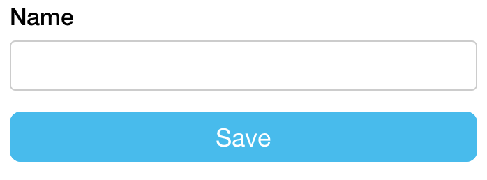
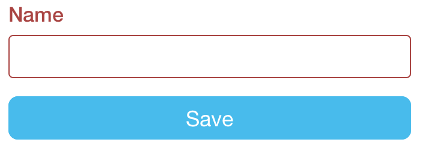
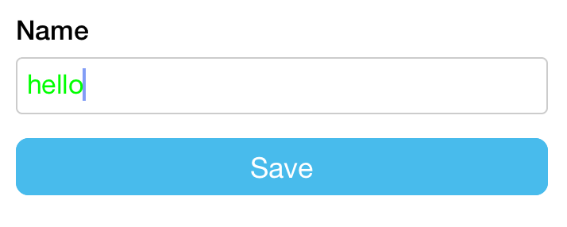
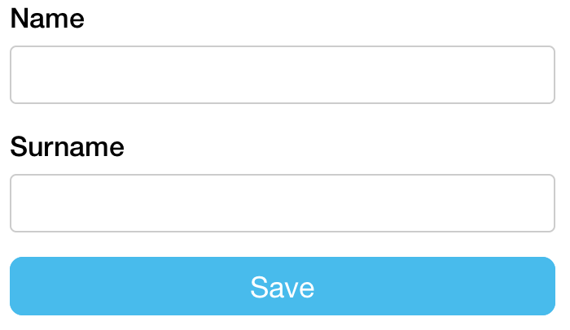
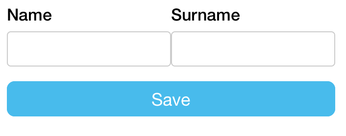
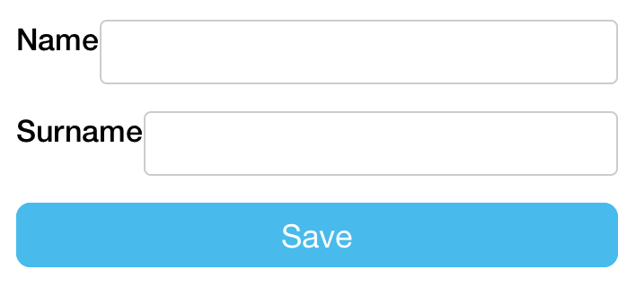
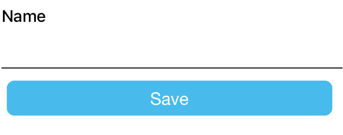

# Stylesheets

There are several levels of customization in `@riebel/tcomb-form-native-ts`:

- stylesheets
- templates
- factories

Let's focus on the first one: stylesheets.

## Basics and tech details

Let's define a simple type useful in the following examples:

```typescript
import t from '@riebel/tcomb-form-native-ts';

const Type = t.struct({ name: t.String });
```

By default this library displays a textbox styled with a bootstrap-like look and feel. The default stylesheet in this package is at `src/stylesheets/bootstrap.ts`.

This is the normal look and feel of a textbox (border: gray)



and this is the look and feel when an error occurs (border: red)



The style management is defined in `src/stylesheets/bootstrap.ts`, specifically by the following lines:

```typescript
textbox: {

  // the style applied without errors
  normal: {
    color: '#000000',
    fontSize: 17,
    height: 36,
    padding: 7,
    borderRadius: 4,
    borderColor: '#cccccc', // <= relevant style here
    borderWidth: 1,
    marginBottom: 5
  },

  // the style applied when a validation error occures
  error: {
    color: '#000000',
    fontSize: 17,
    height: 36,
    padding: 7,
    borderRadius: 4,
    borderColor: '#a94442', // <= relevant style here
    borderWidth: 1,
    marginBottom: 5
  }

}
```

Depending on the state of the textbox, the form passes the proper style to the `<TextInput />` RN component (see `src/fields/Textbox.native.tsx`).

You can override the default stylesheet both locally and globally.

## Overriding the style locally

Say you want the text entered in a textbox to be green:

```tsx
import React from 'react';
import t, { Form } from '@riebel/tcomb-form-native-ts';

// deep clone the default stylesheet (use any deep clone you prefer)
const stylesheet = JSON.parse(JSON.stringify(Form.stylesheet));

// override the text color
// @ts-expect-error partial structure for brevity
stylesheet.textbox.normal.color = '#00FF00';

const options = { fields: { name: { stylesheet } } };

export function Example() {
  return <Form type={Type} options={options} />;
}
```

**Output**



**Note**. This is the list of styles that you can override:

- textbox
  - normal
  - error
  - notEditable
- checkbox
  - normal
  - error
- select
  - normal
  - error
- datepicker
  - normal
  - error
- formGroup
- controlLabel
- helpBlock
- errorBlock
- textboxView

## Overriding the style globally

Just omit the deep clone, the style will be applied globally.

```typescript
import { Form } from '@riebel/tcomb-form-native-ts';

// override the text color for every textbox in every form of your app
// @ts-expect-error partial structure for brevity
Form.stylesheet.textbox.normal.color = '#00FF00';
```

## Examples

### Horizontal forms

Let's add a `surname` field:

```js
const Type = t.struct({
  name: t.String,
  surname: t.String
});
```

The default layout is vertical:



I'll use flexbox in order to display the textboxes horizontally:

```typescript
const stylesheet = JSON.parse(JSON.stringify(Form.stylesheet));

stylesheet.fieldset = {
  flexDirection: 'row'
};
stylesheet.formGroup.normal.flex = 1;
stylesheet.formGroup.error.flex = 1;

const options = { stylesheet };
```

**Output**



### Label on the left side

```typescript
import { Form } from '@riebel/tcomb-form-native-ts';

const stylesheet = JSON.parse(JSON.stringify(Form.stylesheet));

stylesheet.formGroup.normal.flexDirection = 'row';
stylesheet.formGroup.error.flexDirection = 'row';
stylesheet.textboxView.normal.flex = 1;
stylesheet.textboxView.error.flex = 1;

const options = { stylesheet };
```

**Output**




### Material Design Style Underlines

```typescript
import { Form } from '@riebel/tcomb-form-native-ts';

const stylesheet = JSON.parse(JSON.stringify(Form.stylesheet));

stylesheet.textbox.normal.borderWidth = 0;
stylesheet.textbox.error.borderWidth = 0;
stylesheet.textbox.normal.marginBottom = 0;
stylesheet.textbox.error.marginBottom = 0;

stylesheet.textboxView.normal.borderWidth = 0;
stylesheet.textboxView.error.borderWidth = 0;
stylesheet.textboxView.normal.borderRadius = 0;
stylesheet.textboxView.error.borderRadius = 0;
stylesheet.textboxView.normal.borderBottomWidth = 1;
stylesheet.textboxView.error.borderBottomWidth = 1;
stylesheet.textboxView.normal.marginBottom = 5;
stylesheet.textboxView.error.marginBottom = 5;

const options = { stylesheet };
```

**Output**



